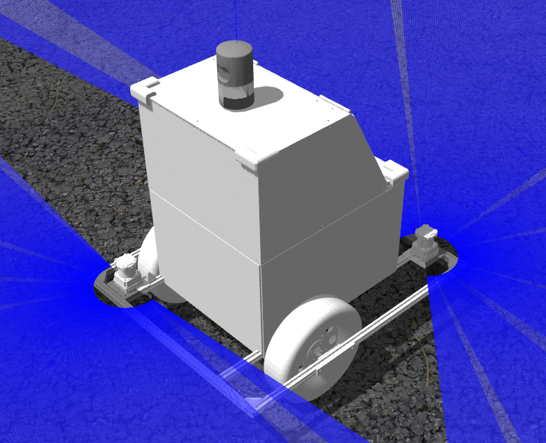
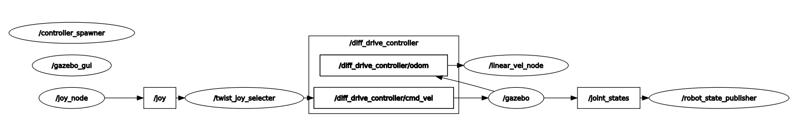

# kcctsim
gazebo上でナビトンを動かすパッケージ
topicがハードウェアを動かす時と対応しているので実物と同じ感覚でシミュレーションが可能

#### Naviton robot model


#### rqt_graph


---
## Dependency

* gazeboのバージョンアップが必要
* 必要パッケージは[rosenv](https://github.com/hrjp/rosenv/blob/main/package_install.bash)
* docker imageを利用する場合[naviton](https://github.com/KobeKosenRobotics/naviton)

```bash
git clone https://github.com/hrjp/rosenv
./rosenv/gazebo_update.bash
./rosenv/package_install.bash
```
---
## sim.launch

```bash
roslaunch kcctsim sim.launch
```

#### Subscribed Topics 

* cmd_vel ([geometry_msgs/Twist](http://docs.ros.org/en/noetic/api/geometry_msgs/html/msg/Twist.html))
    * linear.xで並進速度[m/s] , angular.zで角速度[rad/s]を指定する
    * sim.launch内でtopic名をfinal_cmd_velに変更している

* joy ([sensor_msgs/Joy](https://docs.ros.org/en/api/sensor_msgs/html/msg/Joy.html))
    * Dualshock4の有線接続でロボットを操縦できる
    * shareボタンで手動モード , optionボタンで自動モード

#### Published Topics
* scan1 ([sensor_msgs/LaserScan](http://docs.ros.org/en/api/sensor_msgs/html/msg/LaserScan.html))
    * front LiDAR
    * topic名変更はkcctsim/robots/naviton.urdf.xacro
* scan2 ([sensor_msgs/LaserScan](http://docs.ros.org/en/api/sensor_msgs/html/msg/LaserScan.html))
    * rear LiDAR
    * topic名変更はkcctsim/robots/naviton.urdf.xacro
* tf ([tf/tfMessage](http://docs.ros.org/en/api/tf/html/msg/tfMessage.html))
    * /odom -> /base_foot_point -> /base_link
* velodyne_points ([sensor_msgs/PointCloud2](http://docs.ros.org/en/noetic/api/sensor_msgs/html/msg/PointCloud2.html))
    * HDL-32eのシミュレータ
    * frame_id velodyne
    * topic名変更はkcctsim/robots/naviton.urdf.xacro
* imu/data ([sensor_msgs/Imu](http://docs.ros.org/en/melodic/api/sensor_msgs/html/msg/Imu.html))
    * imuのシミュレータ
    * topic名変更はkcctsim/robots/naviton.urdf.xacro
---
## Kobe Kosen Robotics Navigation Packages
* [naviton](https://github.com/KobeKosenRobotics/naviton)
    * kobe kosen roboticsの自律移動ロボットnavitonの環境構築
* [kcctcore](https://github.com/hrjp/kcctcore)
    * 各パッケージをつなぐマスターパッケージ
* [kcctnavigation](https://github.com/hrjp/kcctnavigation)
    * 自律移動用アルゴリズム全般
* [waypoint_tools](https://github.com/hrjp/waypoint_tools)
    * waypointの読み書きなどwaypointに関連するノード全般
* [kcctsim](https://github.com/hrjp/kcctsim)
    * gazebo simulationとrobotのURDFモデル
* [kcctplugin](https://github.com/hrjp/kcctplugin)
    * 自律移動用のrviz plugin
* [kcctfirm](https://github.com/hrjp/kcctfirm)
    * 自律移動ロボットNavitonのファームウェア
* [LeGO-LOAM](https://github.com/hrjp/LeGO-LOAM)
    * 3D Mapping
    * forked from [LeGO-LOAM](https://github.com/RobustFieldAutonomyLab/LeGO-LOAM)


---
## Reference

* [Gazebo + ROS で自分だけのロボットをつくる](https://qiita.com/RyodoTanaka/items/c3014fd6d0f06d12814f)

* [Autoware](https://github.com/Autoware-AI/autoware.ai)